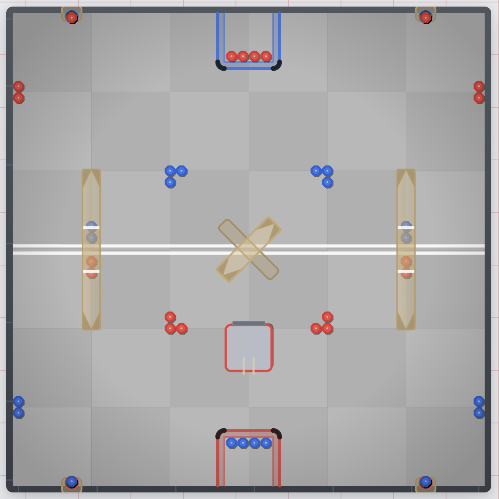

# VEX Machina

A browser-based top-down simulator for the VEX V5 Robotics Competition 2025-2026 game, Push Back.

---

## Demo



---

## Live Demo

[vex-machina.vercel.app](https://vex-machina.vercel.app)

---

## Purpose

Built to let drivers practice Push Back routes and game mechanics without needing a physical field. It is useful for understanding goal interactions, block flow, and general field awareness before a competition.

---

## Features

- Drive a robot around an accurate Push Back field using keyboard controls (WASD or arrow keys)
- Extend the front rake to intake blocks from the field or directly from Loaders (Space or left-click)
- Rear outtake (X) to score into Long Goals or the Upper Center Goal
- Front outtake (C) to score into the Lower Center Goal
- Block physics: friction, circle-circle collisions, OBB-circle collisions, wall bounces
- Goal channel physics: blocks travel along the goal axis, chain-push each other, and scatter on exit
- Park Zone crossing feedback: robot slows briefly when crossing the tape line
- Goal alignment assist: robot auto-corrects heading and lateral position when backing into a Long Goal
- Adjustable robot settings: intake capacity, move speed, and turn rate, persisted in localStorage
- Inch grid and debug overlay toggles
- Field reset (R) returns everything to the starting layout
- Animated splash screen on first visit

---

## Architecture

The simulator is split into four main systems under `src/simulator/`:

- **field**: static field data and coordinate geometry for the Push Back layout
- **physics**: `usePhysics` runs a single `requestAnimationFrame` loop handling robot movement, block collisions, intake, and outtake
- **robot**: robot state types and SVG renderer
- **FieldView**: SVG renderer that layers the floor, goals, blocks, and robot in the correct draw order

---

## Simulation Mechanics

- Robot moves with arcade drive. Heading and position are integrated from speed and turn rate constants.
- Blocks on the field use Coulomb friction and are resolved against walls and the robot using OBB-circle collision.
- Long Goal blocks move only along the goal's Y axis. Blocks pushed past either open end scatter onto the field.
- Center Goal blocks are constrained to their diagonal axis. Upper goal blocks scatter immediately on exit; lower goal blocks travel briefly before spreading.
- Intake captures any field block inside the rake zone in front of the robot, up to the configured capacity.
- Loader blocks dispense one at a time when the robot is positioned at the loader mouth with intake active.

---

## Tech Stack

- React 18
- TypeScript
- Vite

---

## Local Setup

```bash
git clone https://github.com/KevinCui1/VEX-Machina.git
cd VEX-Machina
npm install
npm run dev
```

Open [http://localhost:5173](http://localhost:5173) in your browser.

---

*Unofficial educational project. Not affiliated with VEX Robotics or RECF.*
